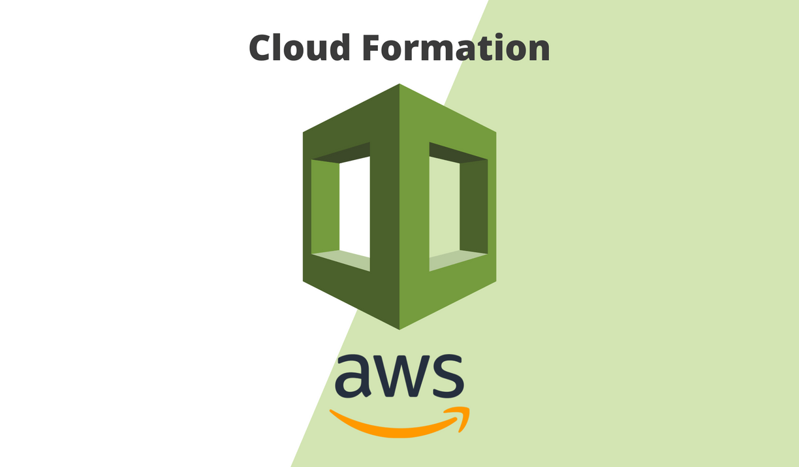
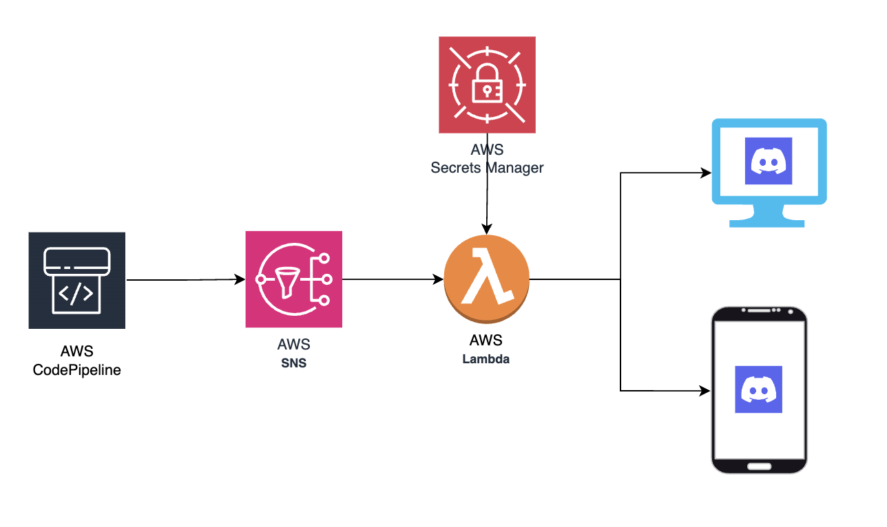
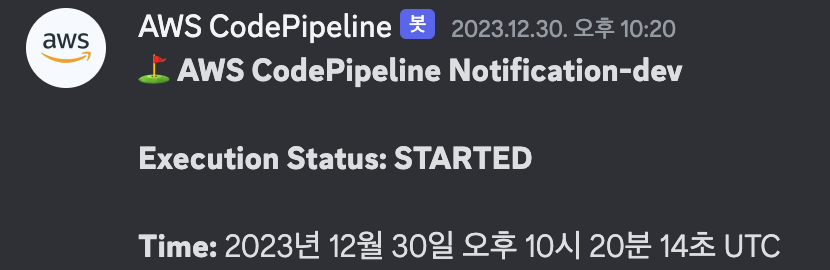
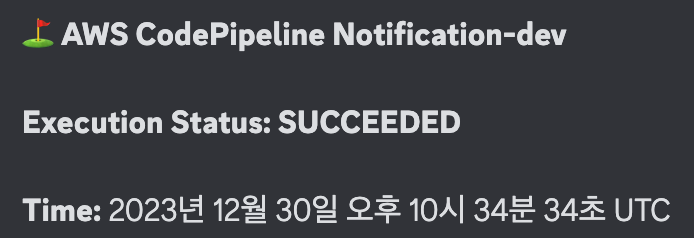
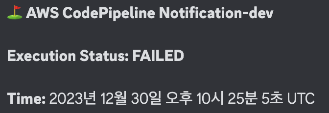

# AWS CloudFormation for Mobile push with FCM

# Architecture

## Summary

CodePipeline 배포 관련 alert 를 Discord 로 전송할 수 있도록 하는 Cloudformation template

## How to Deploy

1. **Discord Webhook 생성**
    - Discord 채널에 Webhook 을 생성하고 URL 복사
    - [Link](https://dev.to/josuebustos/aws-lambda-send-a-message-with-discord-webhooks-12fa) 참고

2. **AWS Secrets Manager 구성**
    - Secrets Manager 리소스를 생성하고 `CODE_PIPELINE_WEBHOOK` key 에 Webhook API 값을 value 으로 삽입.

3. **CodePipelineAlert lambda 리소스 생성**
    - 생성한 Secrets Manager 의 Arn 값을 parameter 로 하여 `lambda.yaml` 템플릿 배포.

4. **CodePipeline 리소스 생성**
    - CodePipeline.yaml 템플릿을 완성 / 배포하여 CodePipeline 리소스 생성.
    - CodePipeline 이 이미 존재할 경우, 해당 리소스의 logical id 값만 가져와도 됨.

5. **SNS 리소스 생성**
    - Lambda 리소스의 Output 인 ServerPipelineAlertLambdaArn 을 parameter 로 하여 `sns.yaml` CloudFormation 템플릿 배포.
    - 이 때 NotificationName parameter 의 값은 `lambda.yaml` 템플릿 배포 시 설정한 값과 같아야 함. 

## Deployment Confirmation Screenshots

### started

### succeeded

### failed

